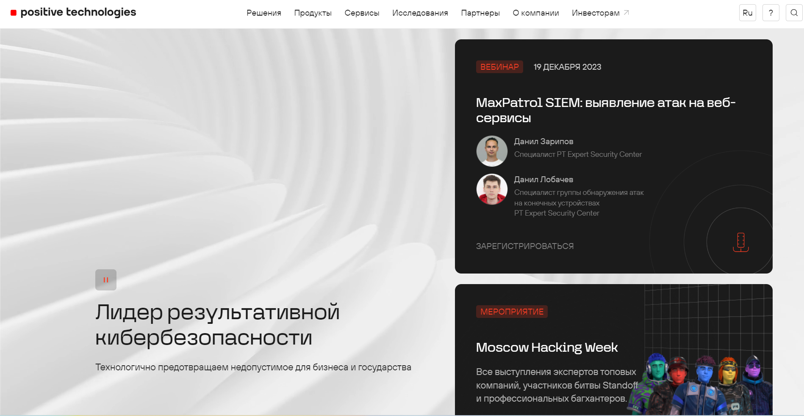
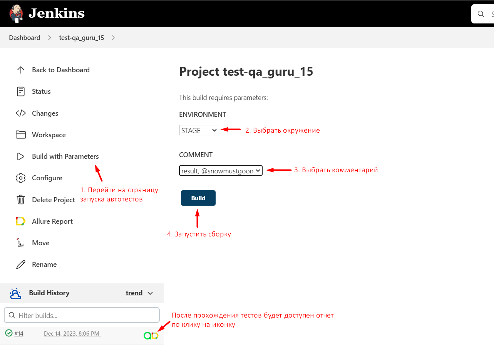
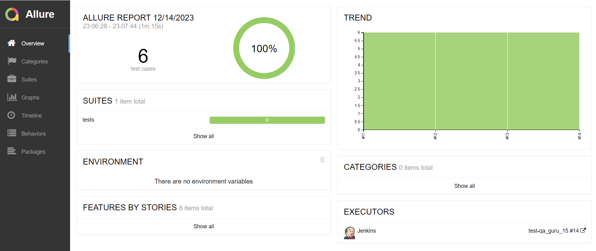
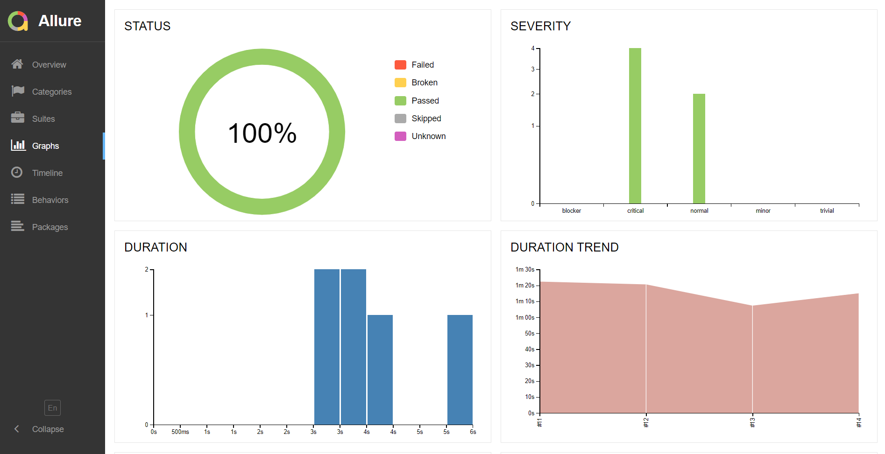
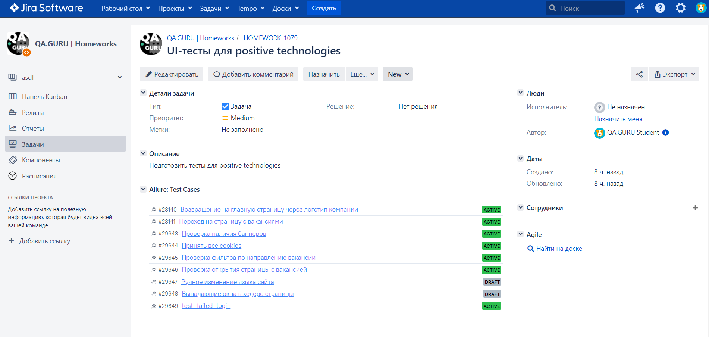
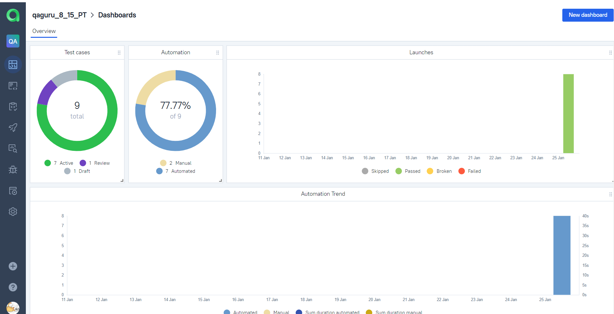
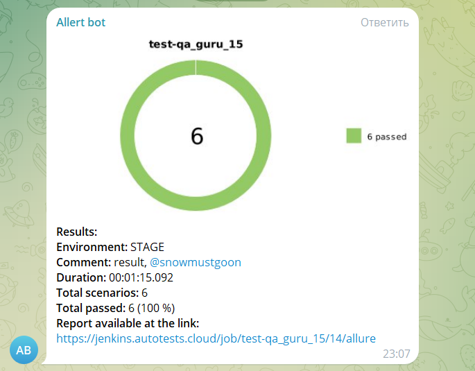
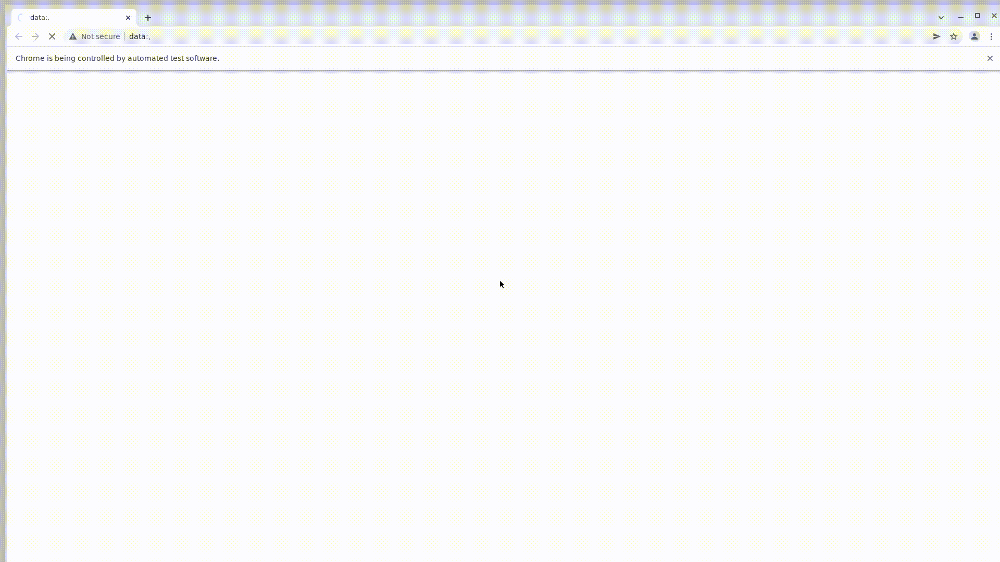

<h1> Проект по тестированию сайта Positive Technologies</h1>

> <a target="_blank" href="https://www.ptsecurity.com/ru-ru/">Ссылка на сайт</a>

### Используемый стэк

          

### Список проверок:
* Проверка наличия баннеров на главной странице
* Проверка поп-ап окна с согласием на использование cookies
* Проверка возвращения на главную страницу через логотип компании
* Проверка перехода на страницу с вакансиями
* Проверка работы фильтра по направлению вакансии
* Проверка открытия детальной информации по вакансии 
* Проверка неуспешной авторизации

----

### Проект в Jenkins
> <a target="_blank" href="https://jenkins.autotests.cloud/job/test-qa_guru_15/">Ссылка на проект в Jenkins</a>

Наш проект возможно запускать через Jenkins. Доступны следующие параметры сборки:
* `environment` - параметр позволяет выбрать окружение, на котором будут запущены тесты
* `comment` - параметр позволяет выбрать комментарий из предложенных

#### Шаги для запуска автотестов через Jenkins

1. Открыть страницу <a target="_blank" href="https://jenkins.autotests.cloud/job/test-qa_guru_15/">проекта</a>
2. В меню выбрать пункт `Build with Parameters`
3. Выбрать окружение в выпадающем списке
4. Выбрать комментарий
5. Нажать кнопку `Build`

После прохождения автотестов в Build History будет доступен отчет

----

### Allure отчет
#### Общие результаты

На странице с общими результатами мы можем увидеть общее количество тестов, сколько из них были успешными и сколько не успешными

#### Отчет прохождения теста

В отчете для каждого кейса доступны 4 приложения. Среди них видеофиксация тест-кейса, скриншот, логи и html страницы

#### Графики прохождения тестов

На странице с графиками мы можем проанализировать наши запуски

----

### Интеграция с Jira

----

### Интеграция с Allure TestOps

#### Общий список всех кейсов

#### Пример Dashboard с графиками по тест-кейсам

----

### Оповещения в Telegram

После выполнения автотестов, запущенных через Jenkins, также придёт уведомление в Telegram_bot об итогах тестирования

----

### Видео-пример прохождения теста

