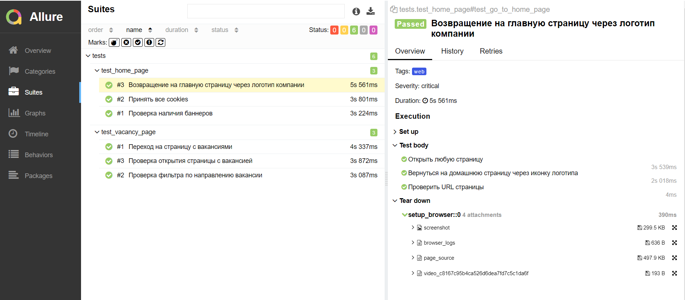

<h1> Проект по тестированию сайта Positive Technologies</h1>

> <a target="_blank" href="https://www.ptsecurity.com/ru-ru/">Ссылка на сайт</a>

### Используемый стэк

         

----

### Проект в Jenkins
> <a target="_blank" href="https://jenkins.autotests.cloud/job/test-qa_guru_15/">Ссылка на проект в Jenkins</a>

#### Параметры сборки

* `environment` - параметр позволяет выбрать окружение, на котором будут запущены тесты
* `comment` - параметр позволяет выбрать комментарий из предложенных

#### Шаги для запуска автотестов через Jenkins

1. Открыть страницу <a target="_blank" href="https://jenkins.autotests.cloud/job/test-qa_guru_15/">проекта</a>
2. В меню выбрать пункт `Build with Parameters`
3. Выбрать окружение в выпадающем списке
4. Выбрать комментарий
5. Нажать кнопку `Build`

После прохождения автотестов в Build History будет доступен отчет

----

### Allure отчет
#### Общие результаты

#### Список тест кейсов

#### Отчет прохождения теста

#### Графики прохождения тестов

### Оповещения в Telegram

